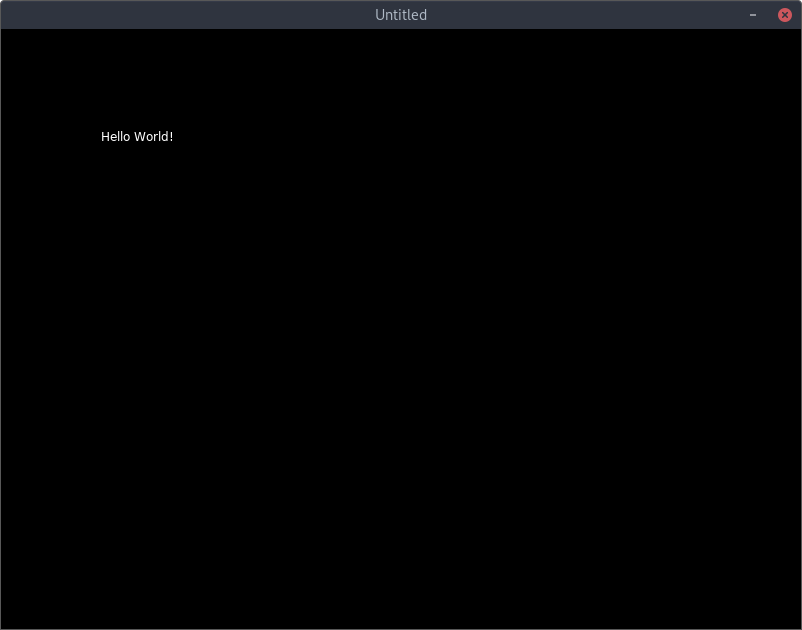

## Tu primer programa en Love2D

Dicho de otro, tu Hello World :-)

### Fichero main.lua

El punto de entrada de todo programa que ejecutamos en Love2D, siempre es el `main.lua`. Empezamos por ahí, creando un fichero nuevo donde escribiremos nuestro programa.

```lua
-- Hello Love!
function love.load()
end

function love.update()
end

function love.draw()
    -- Llamamos a la función love.graphics.print() para imprimir un mensaje en pantalla
    love.graphics.print("Hello World!" 100, 100)
end
```

Y lo ejecutamos. Si estás en Linux o macOS, mi recomendación es lanzarlo desde la terminal. Si estás en Windows, te aconsejo que añadas `love` al PATH, y lo lances desde una ventana de Powershell.

    love main.lua

Si todo va bien, veremos algo como esto:



Más adelante, veremos cómo podemos además empaquetar nuestros juegos.