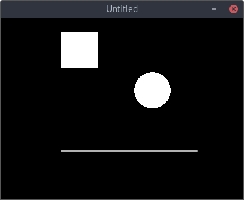
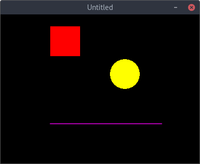

## Dibujando en pantala

### Formas básicas

Love2D proporciona una serie de funciones para dibujar formas básicas, como rectángulos, líneas o círculos. Veremos como dibujar estas formas en pantalla.

```lua
function love.load()
end

function love.update(dt)
end

function love.draw()
    -- Cuadrado
    love.graphics.rectangle("fill", 100, 24, 60, 60)

    -- Círculo
    love.graphics.circle("fill", 250, 120, 30)

    -- Línea
    love.graphics.line(100, 220, 324, 220)
end
```

Pero claro, así están muy sosos, ¿y si le añadimos color...?



```lua
function love.load()
end

function love.update(dt)
end

function love.draw()
    -- Cuadrado
    love.graphics.setColor(1,0,0)
    love.graphics.rectangle("fill", 100, 24, 60, 60)

    -- Círculo
    love.graphics.setColor(1,1,0)
    love.graphics.circle("fill", 250, 120, 30)

    -- Línea
    love.graphics.setColor(1,0,1)
    love.graphics.line(100, 220, 324, 220)
end
```




### Sprites e imágenes

    TO-DO